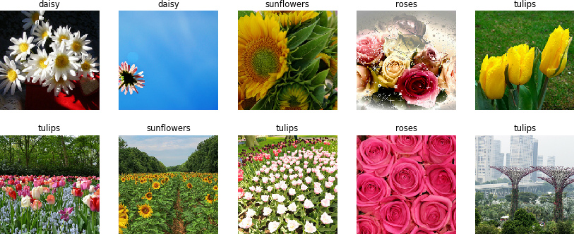
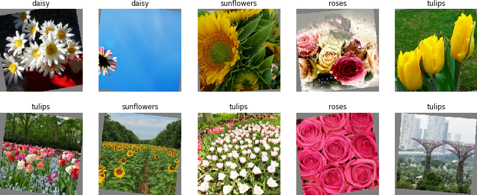
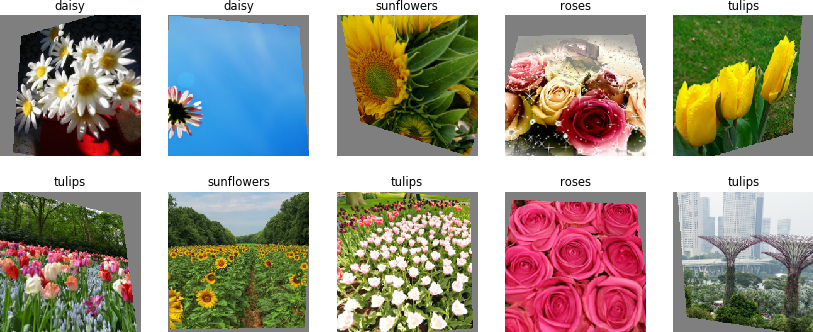
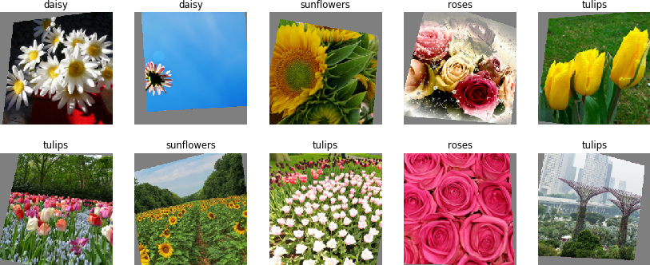
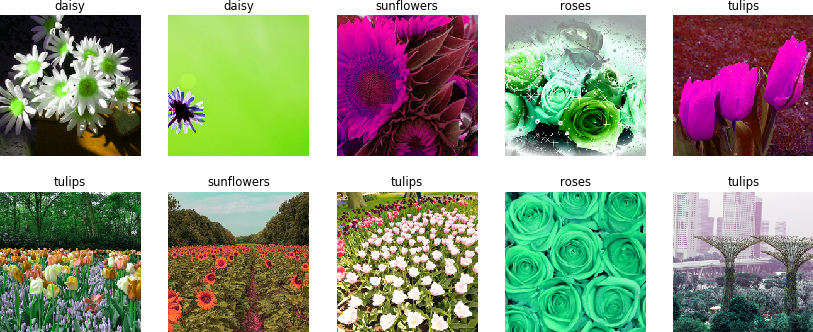
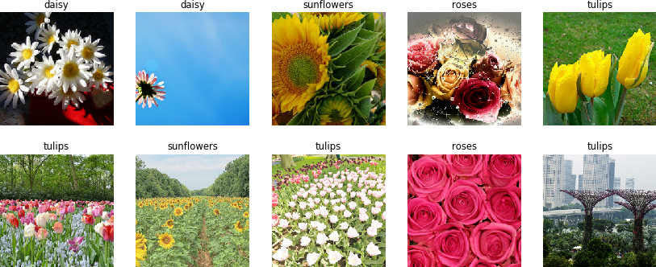
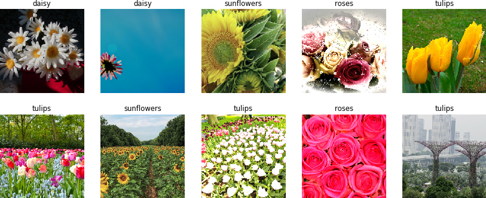
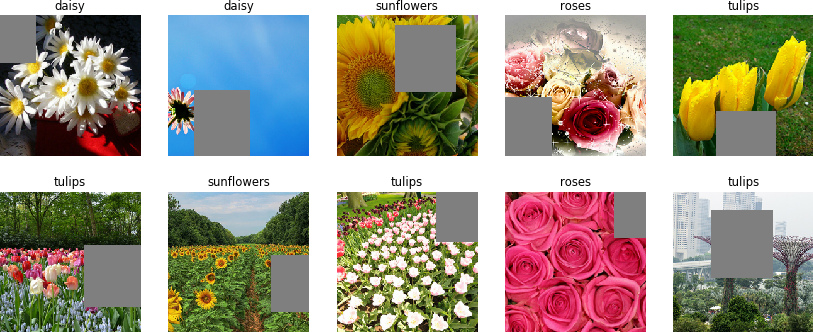
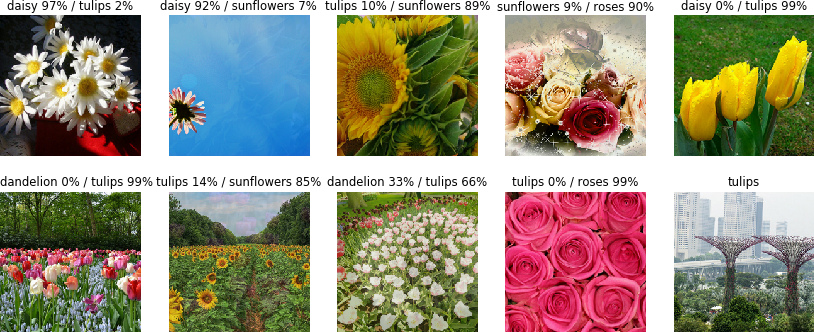
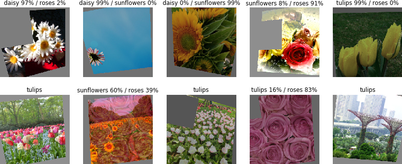

# FastAugment

A handy data augmentation toolkit for image classification put in a single efficient TensorFlow op.

# Overview

Common image preprocessing and data augmentation scripts involve plenty processing blocks run on CPU. Depending on the hardware and number of users sharing the CPU resource, these blocks can turn the CPU load and RAM bandwidth into a bottleneck and cause GPU being underutilized.

This repository offers an easy-to-use replacement of some common augmentation techniques used when training image classification models.

* Computations are entirely run on GPU, extremely efficient
  * Every image in the output batch is sampled only once; all the augmentation transformations are applied in a single pass.
  * Processing a batch of 128 images of 224*224 pixels with all features enabled takes **less than 1 millisecond** on Tesla T4 GPU.
  * While the GPU overhead is marginal, you can keep your CPU busy with something else.

* High quality augmented data on output
  * Augmentation transformations are randomized across the batch, i.e., every image undergoes a different transformation from the same distribution
  * Accurate modelling of small 3D viewpoint changes with common in-plane transformations and perspective distortions for better generalization

* Plug and play, easy to deploy
  * Lightweight, no dependencies
  * Designed to replace a big chunk of a typical data augmentation pipeline with a single call.
    * But indeed can be used just as another processing block.
  * Can be used as a mapping in `tf.data.Dataset` processing pipeline, or as a part of a Keras model, or in any other situation as a TensorFlow operation.


## Features

FastAugment merges some common data augmentation techniques into a single compute block. The transformations parameters are randomly sampled per image from user-defined ranges. The list of implemented transformations follows.

* Geometric transformations:
  * Translation
  * Scale
  * In-plane rotation
  * Perspective distortions (out-of-plane rotation)
  * Horizontal and vertical flipping

* Photometric transformations:
  * Brightness correction
  * Hue correction
  * Color saturation correction
  * Gamma correction
  * Color inversion

* Other common augmentation techniques:
  * CutOut ([paper](https://arxiv.org/pdf/1708.04552.pdf))
  * mixup ([paper](https://arxiv.org/pdf/1710.09412.pdf))


## Limitations

* Image classification-oriented feature set (so far)
* For TensorFlow only (so far)
* Applies on NVidia GPUs only
* Input batch datatype is restricted to `uint8` for performance reasons


# Docs

Using as a `tf.data.Dataset` mapping:
```
from fast_augment import augment

...

data = dataset.batch(batch_size).map(
    lambda x, y: augment(x, y, translation=0.1, rotation=30, mixup=0.5)
)
```


Using as a Keras layer:
```
from fast_augment import Augment

...

model = tf.keras.Sequential([
    ...
    Augment(training_only=True, translation=0.1, rotation=30, mixup=0.5),
    ...
])
```

`augment()` applies a set of random geometry and color transformations to images in a batch.
The applied transformation differs from one image to another one in the same batch. Transformations parameters are sampled from uniform distributions of given ranges.
Their default values enable some moderate amount of augmentations.

Every image is sampled only once through a bilinear interpolator.

Transformation application order:
  - horizontal and/or vertical flipping,
  - perspective distortion,
  - in-plane image rotation and scaling,
  - translation,
  - gamma correction,
  - hue, saturation and brightness correction,
  - mixup,
  - CutOut.

Arguments:
|   |   |
| - | - |
| `x`                | A `Tensor` of `uint8` type containing an input image or batch in channels-last layout (`HWC` or `NHWC`). 3-channel color images are expected (`C=3`). |
| `y`                | A `Tensor` of `float32` type containing input labels in one-hot format. Its outermost dimension is expected to match the batch size. Optional, can be empty. |
| `output_size`      | A list `[W, H]` specifying the output batch width and height in pixels. If none, the input size is kept (default). |
| `output_dtype`     | Output image datatype. Can be `float32` or `uint8`. Default: `float32`. |
| `translation`      | Normalized image translation range along X and Y axis. `0.1` corresponds to a random shift by at most 10% of the image size in both directions (default). If one value given, the same range applies for X and Y axes. |
| `scale`            | Scaling factor range along X and Y axes. `0.1` corresponds to stretching the images by a random factor of at most 10% (default). If one value given, the applied scaling keeps the aspect ratio: the same factor is used along X and Y axes. |
| `prescale`         | A constant scaling factor applied to all images. Can be used to shift the random scaling distribution from its default average equal to 1 and crop out image borders. The default value is 1. |
| `rotation`         | Rotation angle range in degrees. The images are rotated in both clockwise and counter-clockwise direction by a random angle less than `rotation`. Default: 10 degrees. |
| `perspective`      | Perspective distortion range setting the maximum tilting and panning angles in degrees. |
|                    | The image plane is rotated in 3D around X and Y axes (tilt and pan respectively) by random angles smaller than the given value(s). If one number is given, the same range applies for both axes. The default value is 15 degrees. |
| `flip_horizontally` | A boolean. If `True`, the images are flipped horizontally with 50% chance. Default: `True`. |
| `flip_vertically`   | A boolean. If `True`, the images are flipped vertically with 50% chance. Default: `False`. |
| `hue`              | Hue shift range in degrees. The image pixels color hues are shifted by a random angle smaller than `hue`. A hue shift of +/-120 degrees transforms green in red/blue and vice versa. The default value is 10 degrees. |
| `saturation`       | Color saturation factor range. For every input image, the color saturation is scaled by a random factor sampled in range `[1 - saturation, 1 + saturation]`. |
|                    | Applying zero saturation scale produces a grayscale image. The default value is 0.4. |
| `brightness`       | Brightness factor range. For every input image, the intensity is scaled by a random factor sampled in range `[1 - brightness, 1 + brightness]`. The default value is 0.1 |
| `gamma_corr`       | Gamma correction factor range. For every input image, the factor value is randomly sampled in range `[1 - gamma_corr, 1 + gamma_corr]`. |
|                    | Gamma correction boosts (for factors below 1) or reduces (for factors above 1) dark image areas intensity, while bright areas are less affected. The default value is 0.2. |
| `color_inversion`  | A boolean. If `True`, colors of all pixels in every image are inverted (negated) with 50% chance. Default: `False`. |
| `cutout`           | Probability of CutOut being applied to a given input image. The default value is 0.5. CutOut erases a randomly placed rectangular area of an image. See the original paper for more details: https://arxiv.org/pdf/1708.04552.pdf |
| `cutout_size`      | A list specifying the normalized size range CutOut area width and height are sampled from.  `[0.3, 0.5]` range produces a rectangle of 30% to 50% of image size on every side (default). If empty list is passed, CutOut application is disabled. |
| `mixup`            | Probability of mixup being applied to a given input image. Mixup is disabled by default (`mixup` is set to zero). Mixup is applied across the batch. Every two mixed images undergo the same set of other transformations except flipping which can be different. Requires the input labels `y`. If not provided, an exception is thrown. |
| `mixup_alpha`      | Mixup `alpha` parameter (default: 0.4). See the original paper for more details: https://arxiv.org/pdf/1710.09412.pdf |
| `seed`             | Random seed. If different from 0, reproduces the same sequence of transformations for a given set of parameters and input size. |
|   |   |

Returns a `Tensor` with a set of transformations applied to the input image or batch, and another `Tensor` containing the image labels in one-hot format.

# Installation

## TensorFlow

FastAugment easily compiles from source code in a few seconds, only need cmake and any standard C++ compiler. Once the code is compiled, the repository root path is to be appended to `PYTHONPATH` environment variable to enable Python to find the extension.

A complete copy-paste recipe for linux (tested in ubuntu- and RHEL-based distributions):
```bash
git clone https://github.com/lnstadrum/fastaugment.git
cd fastaugment/tensorflow
cmake -B build
make -C build
export PYTHONPATH=$PYTHONPATH:$(pwd)
```

Once compiled and appended to `PYTHONPATH`, FastAugment is ready for use. It is a good thing to make sure that tests are passing before going further though:
```bash
python3 test.py
```

You can also run the example script to get some visuals:
```bash
python3 example.py
```

## PyTorch

For PyTorch, you can compile and install `fast_augment_torch` module as follows:
```bash
git clone https://github.com/lnstadrum/fastaugment.git
cd fastaugment/pytorch
python3 setup.py install --user
```

Make sure everything is fine by running unitary tests:
```bash
python3 test.py
```

You can also run the example script to get some visuals:
```bash
python3 example.py
```

# Illustrations

Input batch (from [tf_flowers dataset](https://www.tensorflow.org/datasets/catalog/tf_flowers)):



## Geometric transformations

In-plane scaling (up to 10%) and rotation (up to +/-10 deg):



Perspective distortions (tilting and panning, up to +/-30 deg):



Combined (scaling up to 10%, in-plane rotation up to  +/-10 deg, panning and tilting up to +/-15 deg, translation up to 10%):



## Photometric transformations

Hue shift up to +/-180 deg (unrealistic):



Gamma correction in [0.25, 1.75] range:



Combined (hue shift up to +/-15 deg, gamma correction in [0.75, 1.25] range, color saturation up to +/-50%, brightness correction in up to +/-30%):



## Other transformations

CutOut with 40% to 50% crop side size:



Mixup:



## Complete set

* Scaling up to 10%
* In-plane rotation up to  +/-10 deg
* Panning and tilting up to +/-15 deg
* Translation up to 10%
* Hue shift up to +/-15 deg
* Gamma correction in [0.75, 1.25] range
* Color saturation up to +/-50%
* Brightness correction in up to +/-30%
* CutOut for 50% of images with 40% to 50% crop side size
* Mixup




# Roadmap

 * Test in a multi-GPU scenario
 * Extend to object detection: enable bounding boxes / keypoints transformation
 * Extend to semantic segmentation: enable nearest-neighbor resampling for segmentation masks
 * Bind to PyTorch: add pybind11 bindings